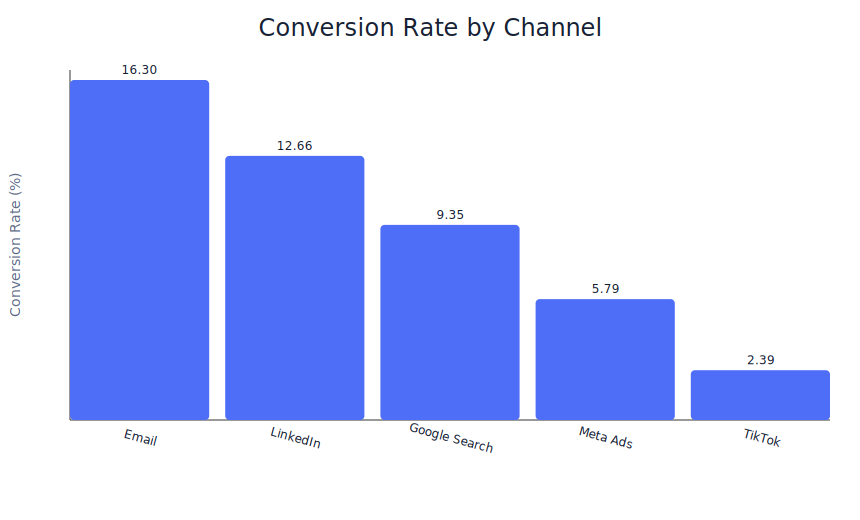
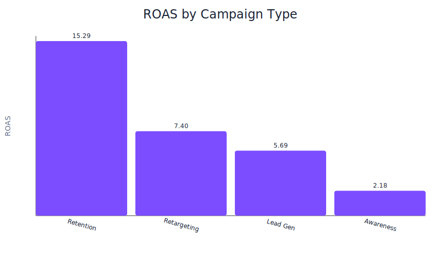
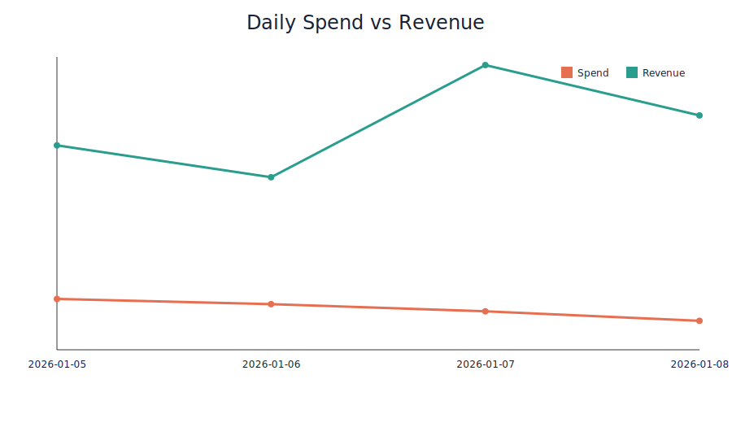

# Marketing Campaign Analytics

A starter analytics project for evaluating digital campaign performance with Python.

## Objective
Identify which channels and campaign types drive better conversion and return-on-ad-spend (ROAS).

## Tech stack
- Python
- pandas
- matplotlib

## Project structure
- `data/sample_campaign_data.csv` – sample campaign dataset
- `src/analyze_campaigns.py` – analysis script
- `reports/figures/` – generated visualization images
- `requirements.txt` – dependencies

## Run
```bash
pip install -r requirements.txt
python src/analyze_campaigns.py
```

## Outputs
The script prints:
- overall totals (spend, clicks, conversions, revenue)
- top channels by conversion rate
- ROAS by campaign type

The script also generates charts in `reports/figures/`.

## Visualizations

### Conversion Rate by Channel


### ROAS by Campaign Type


### Daily Spend vs Revenue


## Next improvements
- Add time-series trend analysis
- Build dashboard in Power BI

## License
MIT
